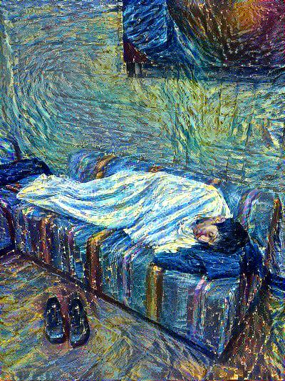
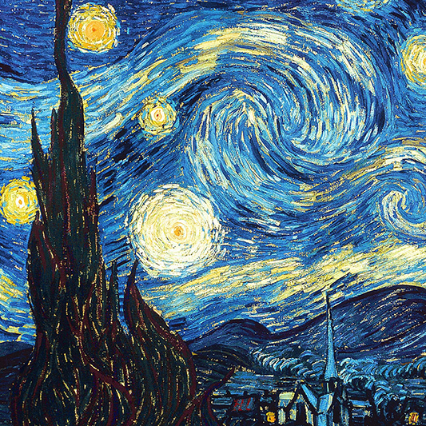
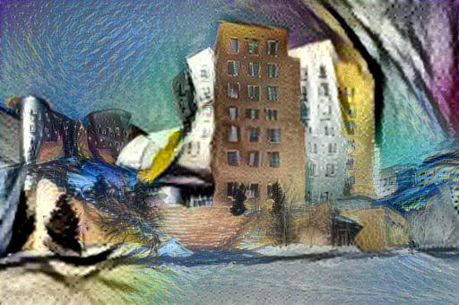
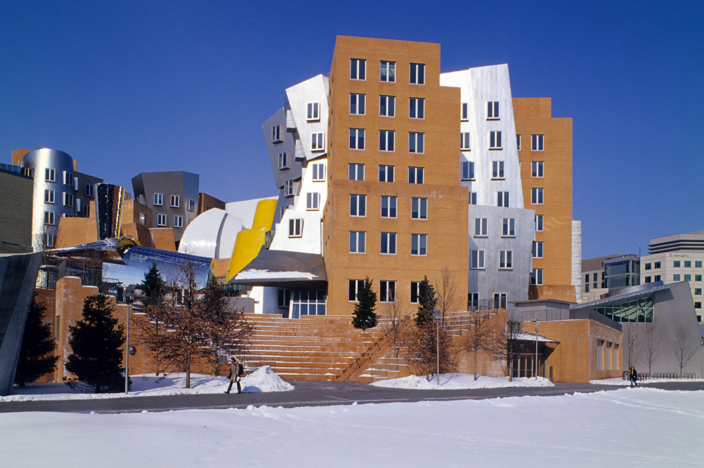
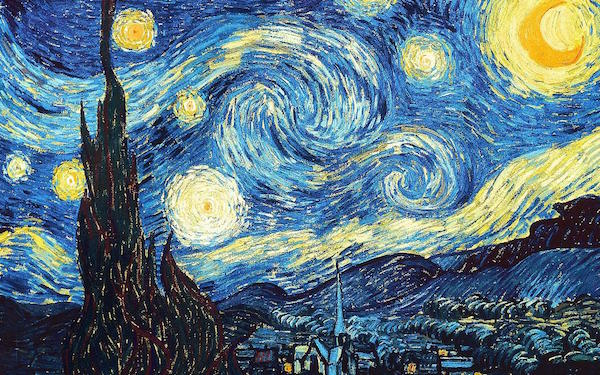

# neural-style

An implementation of [neural style][paper] in TensorFlow.

This implementation is a lot simpler than a lot of the other ones out there,
thanks to TensorFlow's really nice API and [automatic differentiation][ad].

TensorFlow doesn't support [L-BFGS][l-bfgs] (which is what the original authors
used), so we use [Adam][adam]. This may require a little bit more
hyperparameter tuning to get nice results.

**See [here][lengstrom-fast-style-transfer] for an implementation of [fast
(feed-forward) neural style][fast-neural-style] in TensorFlow.**

## Running

`python neural_style.py --content <content file> --styles <style file> --output <output file>`

Run `python neural_style.py --help` to see a list of all options.

Use `--checkpoint-output` and `--checkpoint-iterations` to save checkpoint images.

Use `--iterations` to change the number of iterations (default 1000).  For a 512×512 pixel content file, 1000 iterations take 2.5 minutes on a GeForce GTX Titan X GPU, or 90 minutes on an Intel Core i7-5930K CPU.

## Example 1

Running it for 500-2000 iterations seems to produce nice results. With certain
images or output sizes, you might need some hyperparameter tuning (especially
`--content-weight`, `--style-weight`, and `--learning-rate`).

The following example was run for 1000 iterations to produce the result (with
default parameters):



These were the input images used (me sleeping at a hackathon and Starry Night):




## Example 2

The following example demonstrates style blending, and was run for 1000
iterations to produce the result (with style blend weight parameters 0.8 and
0.2):



The content input image was a picture of the Stata Center at MIT:



The style input images were Picasso's "Dora Maar" and Starry Night, with the
Picasso image having a style blend weight of 0.8 and Starry Night having a
style blend weight of 0.2:




## Requirements

* [TensorFlow](https://www.tensorflow.org/versions/master/get_started/os_setup.html#download-and-setup)
* [NumPy](https://github.com/numpy/numpy/blob/master/INSTALL.rst.txt)
* [SciPy](https://github.com/scipy/scipy/blob/master/INSTALL.rst.txt)
* [Pillow](http://pillow.readthedocs.io/en/3.3.x/installation.html#installation)
* [Pre-trained VGG network][net] (MD5 `8ee3263992981a1d26e73b3ca028a123`) - put it in the top level of this repository, or specify its location using the `--network` option.

## Citation

If you use this implementation in your work, please cite the following:

```
@misc{athalye2015neuralstyle,
  author = {Anish Athalye},
  title = {Neural Style},
  year = {2015},
  howpublished = {\url{https://github.com/anishathalye/neural-style}},
  note = {commit xxxxxxx}
}
```

## License

Copyright (c) 2015-2016 Anish Athalye. Released under GPLv3. See
[LICENSE.txt][license] for details.

[net]: http://www.vlfeat.org/matconvnet/models/beta16/imagenet-vgg-verydeep-19.mat
[paper]: http://arxiv.org/pdf/1508.06576v2.pdf
[l-bfgs]: https://en.wikipedia.org/wiki/Limited-memory_BFGS
[adam]: http://arxiv.org/abs/1412.6980
[ad]: https://en.wikipedia.org/wiki/Automatic_differentiation
[lengstrom-fast-style-transfer]: https://github.com/lengstrom/fast-style-transfer
[fast-neural-style]: https://arxiv.org/pdf/1603.08155v1.pdf
[license]: LICENSE.txt
