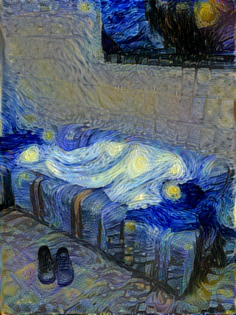
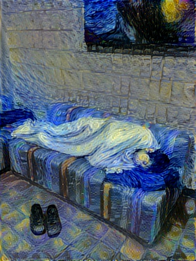
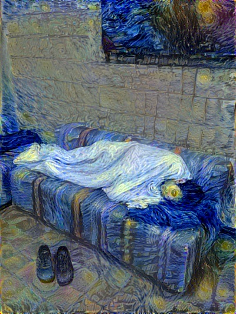
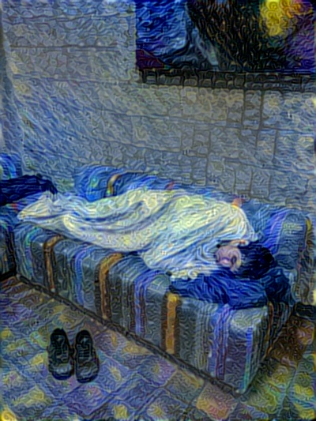

# neural-style

An implementation of [neural style][paper] in TensorFlow.

This implementation is a lot simpler than a lot of the other ones out there,
thanks to TensorFlow's really nice API and [automatic differentiation][ad].

TensorFlow doesn't support [L-BFGS][l-bfgs] (which is what the original authors
used), so we use [Adam][adam]. This may require a little bit more
hyperparameter tuning to get nice results.

## Related Projects

See [here][lengstrom-fast-style-transfer] for an implementation of [fast
(feed-forward) neural style][fast-neural-style] in TensorFlow.

**[Try neural style](https://tenso.rs/demos/fast-neural-style/) client-side in
your web browser without installing any software (using
[TensorFire](https://tenso.rs/)).**

## Running

`python neural_style.py --content <content file> --styles <style file> --output <output file>`

Run `python neural_style.py --help` to see a list of all options.

If you are running this project on [Floydhub](https://www.floydhub.com) you can use the following syntax (this pulls in the pre-trained VGG network automatically):

`floyd run --gpu --env tensorflow-1.3
--data  floydhub/datasets/imagenet-vgg-verydeep-19/3:vgg
"python neural_style.py --network /vgg/imagenet-vgg-verydeep-19.mat --content <content file> --styles <style file> --output <output file>"`


Use `--checkpoint-output` and `--checkpoint-iterations` to save checkpoint images.

Use `--iterations` to change the number of iterations (default 1000).  For a 512×512 pixel content file, 1000 iterations take 60 seconds on a GTX 1080 Ti, 90 seconds on a Maxwell Titan X, or 60 minutes on an Intel Core i7-5930K. Using a GPU is highly recommended due to the huge speedup.

## Example 1

Running it for 500-2000 iterations seems to produce nice results. With certain
images or output sizes, you might need some hyperparameter tuning (especially
`--content-weight`, `--style-weight`, and `--learning-rate`).

The following example was run for 1000 iterations to produce the result (with
default parameters):


These were the input images used (me sleeping at a hackathon and Starry Night):


## Example 2

The following example demonstrates style blending, and was run for 1000
iterations to produce the result (with style blend weight parameters 0.8 and
0.2):


The content input image was a picture of the Stata Center at MIT:


The style input images were Picasso's "Dora Maar" and Starry Night, with the
Picasso image having a style blend weight of 0.8 and Starry Night having a
style blend weight of 0.2:


## Tweaking

`--style-layer-weight-exp` command line argument could be used to tweak how "abstract"
the style transfer should be. Lower values mean that style transfer of a finer features
will be favored over style transfer of a more coarse features, and vice versa. Default
value is 1.0 - all layers treated equally. Somewhat extreme examples of what you can achieve:




(**left**: 0.2 - finer features style transfer; **right**: 2.0 - coarser features style transfer)

`--content-weight-blend` specifies the coefficient of content transfer layers. Default value -
1.0, style transfer tries to preserve finer grain content details. The value should be
in range [0.0; 1.0].




(**left**: 1.0 - default value; **right**: 0.1 - more abstract picture)

`--pooling` allows to select which pooling layers to use (specify either `max` or `avg`).
Original VGG topology uses max pooling, but the [style transfer paper][paper] suggests
replacing it with average pooling. The outputs are perceptually differnt, max pool in
general tends to have finer detail style transfer, but could have troubles at
lower-freqency detail level:




(**left**: max pooling; **right**: average pooling)

`--preserve-colors` boolean command line argument adds post-processing step, which
combines colors from the original image and luma from the stylized image (YCbCr color
space), thus producing color-preserving style transfer:


(**left**: original stylized image; **right**: color-preserving style transfer)

## Requirements

### Data Files

* [Pre-trained VGG network][net] (MD5 `106118b7cf60435e6d8e04f6a6dc3657`) - put it in the top level of this repository, or specify its location using the `--network` option.

### Dependencies

You can install Python dependencies using `pip install -r requirements.txt`,
and it should just work. If you want to install the packages manually, here's a
list:

* [TensorFlow](https://www.tensorflow.org/versions/master/get_started/os_setup.html#download-and-setup)
* [NumPy](https://github.com/numpy/numpy/blob/master/INSTALL.rst.txt)
* [SciPy](https://github.com/scipy/scipy/blob/master/INSTALL.rst.txt)
* [Pillow](http://pillow.readthedocs.io/en/3.3.x/installation.html#installation)

## Citation

If you use this implementation in your work, please cite the following:

```
@misc{athalye2015neuralstyle,
  author = {Anish Athalye},
  title = {Neural Style},
  year = {2015},
  howpublished = {\url{https://github.com/anishathalye/neural-style}},
  note = {commit xxxxxxx}
}
```

## License

Copyright (c) 2015-2018 Anish Athalye. Released under GPLv3. See
[LICENSE.txt][license] for details.

[net]: http://www.vlfeat.org/matconvnet/models/imagenet-vgg-verydeep-19.mat
[paper]: http://arxiv.org/pdf/1508.06576v2.pdf
[l-bfgs]: https://en.wikipedia.org/wiki/Limited-memory_BFGS
[adam]: http://arxiv.org/abs/1412.6980
[ad]: https://en.wikipedia.org/wiki/Automatic_differentiation
[lengstrom-fast-style-transfer]: https://github.com/lengstrom/fast-style-transfer
[fast-neural-style]: https://arxiv.org/pdf/1603.08155v1.pdf
[license]: LICENSE.txt
